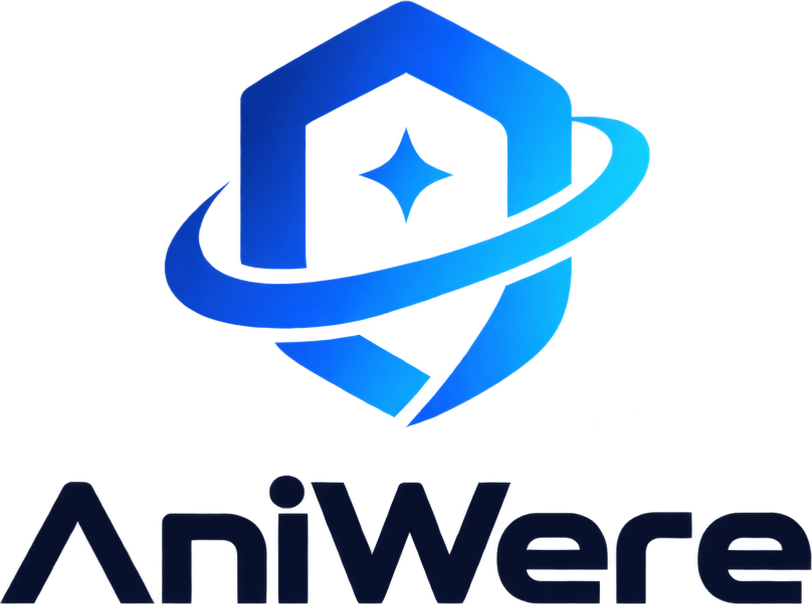
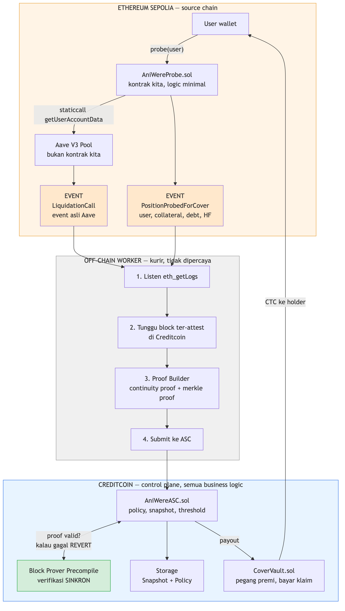

<p align="center"></p>

**Parametric liquidation cover untuk posisi lending cross-chain, di atas Attestcoin Protocol.**

*Your position lives anywhere. Your protection lives here.*

> BUIDL CTC 2026 Fall — Track DeFi

---

## Apa ini

User membeli proteksi di **Creditcoin** untuk posisi Aave V3 mereka di **Ethereum**. Kalau posisi itu benar-benar kena likuidasi, event `LiquidationCall` dari Ethereum dibuktikan secara kriptografis lewat **Attestcoin Protocol**, dan payout cair otomatis.

Tanpa klaim manual. Tanpa komite. Tanpa oracle terpusat. Tanpa bridge.

---

## Status jujur

Ditulis di sini, di atas, supaya tidak ada yang perlu menebak.

| | Status |
|---|---|
| Kontrak Sepolia (`AniWereProbe`) | Selesai, 4/4 test hijau |
| Kontrak Creditcoin (`AniWereASC`, `CoverVault`, `AttestcoinAdapter`) | Selesai, 12/12 test hijau |
| Jalur verifikasi Attestcoin | **Terbukti hidup.** Proof dari transaksi Sepolia sungguhan diterima precompile; empat variasi proof rusak semuanya revert |
| Worker proof off-chain | Selesai, dan `status` sudah dijalankan terhadap endpoint asli |
| Frontend | Tiga halaman, tersambung ke chain lewat wagmi. Tanpa deployment ia berjalan dalam **mode contoh** yang diberi label — lihat catatan di bawah |
| Deployment ke testnet | **Belum.** Terhalang wallet + faucet Creditcoin |

Yang menghalangi bukan kode. `AniWereProbe`, `AniWereASC`, dan worker semuanya siap dijalankan; yang belum ada adalah wallet yang terdanai untuk membayar gas di kedua chain. Begitu wallet itu ada, urutan perintahnya sudah tertulis di [Deploy](#deploy) dan tidak ada satu pun yang perlu ditulis ulang.

Frontend punya dua mode, dan yang menentukan hanya satu env var:

- **Mode contoh** (`NEXT_PUBLIC_ASC_ADDRESS` kosong) — angka posisi dan polis adalah data contoh, dan setiap halaman memakai banner yang mengatakan itu. Tombol on-chain mati.
- **Mode live** (env terisi) — seluruh angka dibaca dari kontrak lewat wallet yang tersambung. Banner hilang. Probe, buy cover, dan submit claim semuanya berjalan dari browser.

Yang **selalu** nyata di kedua mode: tinggi blok di header dan panel attestation di Proof Explorer. Keduanya dibaca dari Sepolia dan Proof Builder di tiap request, tanpa wallet dan tanpa deployment.

---

## Apa yang sebenarnya dibuktikan

Ini bagian yang paling sering disalahpahami, jadi ditulis eksplisit.

**Attestcoin Readability membuktikan bahwa sebuah transaksi terjadi di block source chain**, lewat dua proof yang bekerja bersama:

- **Continuity proof** — block itu memang bagian dari rantai Ethereum yang sudah ter-attest di Creditcoin
- **Merkle proof** — transaksi itu memang termasuk di dalam block tersebut

Keduanya diverifikasi **sinkron** oleh Block Prover Precompile di `0x…0FD2`, jadi verifikasi dan payout terjadi dalam satu transaksi Creditcoin yang sama.

**Yang bisa dibuktikan:** event di receipt log sebuah transaksi.
**Yang TIDAK bisa dibuktikan:** storage slot.

Konsekuensinya, `IPool.getUserAccountData(user)` tidak bisa dibuktikan secara langsung, karena itu view call terhadap storage dan tidak meninggalkan jejak di receipt log mana pun. Karena itu kami memakai **prober pattern**: kontrak di Sepolia memanggil Aave lalu meng-emit hasilnya sebagai event, dan event itulah yang dibuktikan.

Precompile mengembalikan `bool`, **bukan** log. Receipt harus di-decode sendiri di sisi Creditcoin. Itu tugas `AttestcoinAdapter`, dan seluruh ketidakpastian Attestcoin berhenti di file itu — `AniWereASC` tidak tahu-menahu soal precompile.

---

## Arsitektur

```
ETHEREUM SEPOLIA                 WORKER              CREDITCOIN
─────────────────                ──────              ──────────
AniWereProbe.probe(user)
  └─ call Aave V3
  └─ emit PositionProbedForCover ──┐
                                   ├─► filter log
Aave V3 Pool                       │   tunggu attestation (~8 mnt)
  └─ emit LiquidationCall ─────────┘   minta proof
                                       submit ──────► AniWereASC
                                                        ├─ AttestcoinAdapter
                                                        │    ├─ Block Prover (sinkron)
                                                        │    └─ decode receipt
                                                        ├─ _findLog: emitter + topic0
                                                        ├─ validasi polis
                                                        └─ CoverVault.payClaim()
```



Dua flow detail — beli cover dan klaim/payout — ada sebagai diagram terpisah:

| Flow | Diagram |
|---|---|
| Beli cover | [`2-flow-beli-cover.png`](docs/diagrams/2-flow-beli-cover.png) |
| Klaim & payout | [`3-flow-klaim-payout.png`](docs/diagrams/3-flow-klaim-payout.png) |

Sumber `.mermaid`-nya ada di [`docs/diagrams/`](docs/diagrams/); PNG di-render dengan
`mmdc -t default -b white -s 3`.

---

## Keputusan desain

### No privileged access

`CoverVault` di-deploy **oleh** `AniWereASC` di dalam constructor-nya, sehingga alamat ASC di vault bersifat `immutable` dan tidak ada setter sama sekali.

- Tidak ada `owner`, `onlyOwner`, `pause`, atau upgrade
- Tidak ada fungsi withdraw untuk tim
- Dana hanya keluar lewat dua jalan: payout yang dipicu proof valid, atau penarikan underwriter atas modal yang tidak sedang terkunci

Tim AniWere secara teknis tidak bisa menyentuh dana siapa pun. Kalau ada yang bertanya kenapa harus percaya kami: tidak perlu, dan itu justru intinya.

### Worker tidak dipercaya

Off-chain worker cuma kurir. Kalau dia mengirim proof palsu, precompile menolak dan transaksi revert. Dia juga mengirim **seluruh receipt**, bukan satu log pilihan — pemilihan log dilakukan `_findLog` di dalam kontrak, jadi worker tidak punya kesempatan untuk memilihkan.

Satu-satunya hal yang bisa dilakukan worker jahat adalah tidak mengirim. Dan karena `submitLiquidationClaim` permissionless, siapa pun bisa menggantikannya.

### Solvency guard

Total cover aktif tidak boleh melebihi modal bebas di vault. Vault secara matematis tidak bisa insolvent.

### Tidak pernah menghitung ulang health factor

Kami memakai angka dari `getUserAccountData` apa adanya, sehingga HF yang dibuktikan identik dengan yang dipakai Aave untuk memutuskan likuidasi. Menghitung ulang dengan sumber harga lain akan langsung mengembalikan trust assumption yang mau dihilangkan.

### Frontend tidak pernah jadi jalur wajib

Tiga aksi on-chain di UI — probe, submit position proof, submit liquidation claim — semuanya punya padanan satu baris di worker, dan halaman yang bersangkutan menampilkan perintahnya. Ini bukan duplikasi yang kelewat: `submitPositionProof` dan `submitLiquidationClaim` memang permissionless, jadi pemegang polis tidak pernah bergantung pada frontend maupun worker kami untuk dibayar.

Proof diambil lewat route server sendiri (`/api/attestcoin/*`) karena Proof Builder tidak mengirim header CORS. Route itu tidak menambah wewenang apa pun — proof yang lewat sana tetap harus lolos precompile di kontrak.

### Pengecekan emitter

`_findLog` mencocokkan **emitter dan topic0**, bukan topic0 saja. Tanpa itu, siapa pun bisa deploy kontrak di Sepolia yang meng-emit event dengan signature sama dan menguras vault.

Ini lebih ketat daripada contoh resmi Attestcoin, yang `getLogsByEventSignature`-nya menyaring topic0 saja. Ada tesnya: `test_RejectsLiquidationFromWrongEmitter`.

### Anti-replay mengikat blok, bukan cuma transaksi

`proofId` adalah hash dari chainKey + height + merkle root + isi transaksi. Kalau ia hanya hash dari raw transaction, transaksi yang sama masih bisa dikirim ulang lewat blok berbeda. Ada tesnya: `test_SameTransactionAtDifferentHeightIsSeparateProof`.

---

## Struktur repo

```
aniwere/
├── app/                    Frontend (Next.js)
├── contracts-sepolia/      Foundry — AniWereProbe.sol
├── contracts-creditcoin/   Foundry — AniWereASC.sol, CoverVault.sol, AttestcoinAdapter.sol
├── worker/                 Off-chain proof worker (TypeScript + viem)
└── docs/
    ├── PRD.md              Konteks produk
    ├── ATTESTCOIN.md       Catatan validasi live — dokumen paling penting kedua setelah ini
    ├── DEMO.md             Runbook deploy + demo
    ├── SPRINT.md           Rencana harian
    └── diagrams/
```

Dua project Foundry terpisah, bukan satu. Config network dan target EVM-nya berbeda, dan menggabungkannya membuat deploy gampang tertukar.

---

## Hasil test

```
contracts-sepolia      4 passed, 0 failed
contracts-creditcoin  12 passed, 0 failed
```

Yang dijaga oleh test, bukan sekadar dihitung:

| Test | Yang dicegah |
|---|---|
| `test_RejectsLiquidationFromWrongEmitter` | Kontrak palsu di Sepolia menguras vault |
| `test_RejectsReplayedProof` | Satu likuidasi dibayar dua kali |
| `test_SameTransactionAtDifferentHeightIsSeparateProof` | `proofId` yang terlalu lemah |
| `test_CannotOversellCover` | Vault menjual proteksi melebihi modalnya |
| `test_UnderwriterCannotWithdrawLockedCapital` | Modal ditarik saat masih menjamin polis aktif |
| `test_CannotBuyCoverWhenAlreadyUnhealthy` | Beli proteksi ketika likuidasi praktis sudah pasti |
| `test_CannotBuyCoverWithStaleSnapshot` | Beli proteksi dengan angka posisi yang basi |
| `test_OnlyASCCanTouchVault` | Siapa pun selain ASC memindahkan dana |

Semua test berjalan di atas `MockProver`. Precompile pallet-evm tidak punya bytecode, jadi fork test Foundry tidak bisa menyentuhnya — jalur decoding receipt yang sesungguhnya baru terbukti saat deployment ke testnet.

---

## Setup

```bash
# Sisi source chain
cd contracts-sepolia
forge install foundry-rs/forge-std --no-git
cp .env.example .env      # isi dulu
forge build && forge test

# Sisi Creditcoin
cd ../contracts-creditcoin
forge install foundry-rs/forge-std --no-git
cp .env.example .env      # isi dulu
forge build && forge test

# Worker
cd ../worker
npm install
cp .env.example .env
npm run status            # cek Sepolia, Proof Builder, Creditcoin. Tidak butuh wallet.
```

Kalau repo ini sudah berupa git repo, hapus `--no-git` agar dependency masuk sebagai submodule.

### Deploy

```bash
# 1. Probe ke Sepolia
cd contracts-sepolia
forge script script/DeployProbe.s.sol:DeployProbe --rpc-url sepolia --broadcast --verify

# 2. Masukkan alamatnya ke contracts-creditcoin/.env sebagai SOURCE_PROBE_SEPOLIA
#    dan ke worker/.env sebagai PROBE_ADDRESS

# 3. ASC ke Creditcoin
cd ../contracts-creditcoin
forge script script/DeployASC.s.sol:DeployASC --rpc-url creditcoin_testnet --broadcast --legacy

# 4. Fund vault sebelum demo
cast send <vault> "depositCapital()" --value 500ether --rpc-url creditcoin_testnet --private-key $PRIVATE_KEY
```

`EvmV1Decoder` adalah library dengan fungsi public, jadi forge men-deploy-nya lebih dulu dan me-link otomatis. Kalau estimasi gas gagal, tambahkan `--gas-estimate-multiplier 135`.

### Menjalankan alur penuh

```bash
cd worker
npm run worker -- status                      # semua hijau dulu
npm run worker -- probe 0xUSER                # emit event di Sepolia
npm run worker -- submit-position 0xTX        # tunggu attest, buktikan, simpan di Creditcoin
npm run worker -- watch                       # loop: pantau probe + likuidasi
```

Detail worker ada di [`worker/README.md`](worker/README.md).

Runbook lengkap dari wallet kosong sampai rekaman selesai — termasuk apa yang
harus dilakukan kalau likuidasi tidak bisa dipicu atau precompile menolak — ada
di [`docs/DEMO.md`](docs/DEMO.md).

---

## Ekspektasi latency

Jangan pakai kata "real-time".

| Tahap | Terukur |
|---|---|
| Blok sumber masuk Sepolia | 0 |
| Ter-attest di Creditcoin | ~38–40 blok, **~8 menit** |
| Verifikasi proof + payout | satu block Creditcoin (~15 detik) |
| **Total** | **~8 menit** |

Framing yang benar:

> **Verified one Creditcoin block after the source block is attested — about 8 minutes after it lands on Ethereum.**

Dua pengukuran independen, 27 Agustus dan 4 September, dengan alat ukur berbeda. Angkanya praktis identik. Rinciannya di [`docs/ATTESTCOIN.md`](docs/ATTESTCOIN.md) bagian 4.

Kami **tidak** memakai kalimat *"within one Creditcoin block of Ethereum finality"*, walaupun kalimat itu enak dibaca. Attestation terukur berjalan 25–30 blok **di depan** `finalized`, jadi kalimat itu menjanjikan jaminan yang protokolnya memang tidak berikan. Konsekuensinya ada di daftar keterbatasan di bawah, nomor 2.

---

## Keterbatasan yang kami akui

1. **Snapshot, bukan streaming.** Health factor terverifikasi berlaku pada block tertentu. Di antara dua probe, kami tidak tahu apa-apa. Ini konsekuensi langsung dari model event proof.
2. **Attestation mendahului finality Ethereum.** Proof bisa lolos untuk blok yang secara teori masih bisa ter-reorg. Kedalaman 25–30 blok jauh di luar reorg yang wajar di Ethereum, tapi "jauh di luar" bukan "mustahil", dan kami memilih menuliskannya daripada bersembunyi di balik kata *finality*.
3. **Kami tidak mencegah likuidasi.** Kami membayar setelahnya. Pencegahan butuh Attestcoin Writability, di luar scope hackathon.
4. **Premi flat 2%, bukan risk-priced.** Model pricing sungguhan butuh data historis dan analisis kuantitatif.
5. **Sisi underwriter disederhanakan.** Vault di-fund manual. Belum ada share accounting, lock period, atau ekonomi underwriting yang sesungguhnya.
6. **Satu chain, satu protokol.** Arsitekturnya generalizable, implementasinya belum.
7. **Jalur decoding receipt belum diuji di jaringan asli.** Precompile tidak punya bytecode, jadi test lokal berhenti di `MockProver`. Ini risiko terbuka terbesar yang tersisa.

---

## Roadmap

Empat item, masing-masing lahir dari keterbatasan di atas.

1. **Multi source chain** (Arbitrum, Base, Polygon) — satu pool modal yang menjamin banyak chain adalah alasan Creditcoin dipakai sejak awal.
2. **Capital efficiency** — modal underwriter menganggur sepanjang periode polis, dan opportunity cost itu jadi lantai harga yang dibayar user lewat premi. Men-deploy idle capital ke yield strategy konservatif menurunkan lantai itu. Catatan risiko: ini menambah exposure baru, karena exploit di protokol tujuan akan menghilangkan dana klaim justru saat paling dibutuhkan. Karena itu strateginya harus konservatif dan porsinya dibatasi.
3. **Risk-priced premium** — flat rate tidak adil untuk posisi konservatif dan terlalu murah untuk posisi agresif.
4. **Automated protection via Writability** — mencegah lebih baik daripada mengganti.

---

## Alamat yang dipakai

| Kontrak | Alamat | Cara verifikasi |
|---|---|---|
| Aave V3 Pool (Sepolia) | `0x6Ae43d3271ff6888e7Fc43Fd7321a503ff738951` | `PoolAddressesProvider.getPool()`, dipanggil langsung |
| Aave PoolAddressesProvider | `0x012bAC54348C0E635dCAc9D5FB99f06F24136C9A` | — |
| Block Prover Precompile | `0x0000000000000000000000000000000000000FD2` | `eth_call` dengan proof asli → `true` |
| Chain Info Precompile | `0x0000000000000000000000000000000000000FD3` | `get_supported_chains()` |
| chainKey Sepolia | `1` | Dari `get_supported_chains()`. **Bukan** chain ID 11155111 |

Tidak satu pun disalin dari dokumentasi tanpa dicek.

---

## Lisensi

MIT
